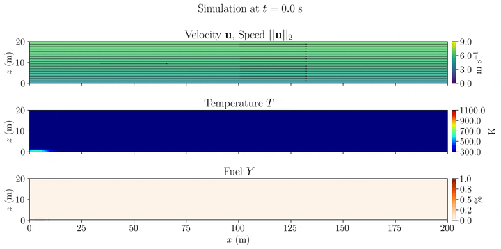
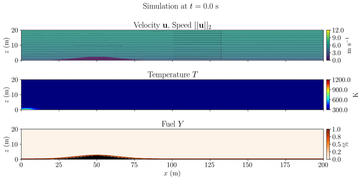

# Coupled Atmosphere-Wildfire Model
Numerical implementation of a simplified coupled atmosphere-fire mathematical model.

## Mathematical model
This code solves the following system of PDEs to simulate the spread of wildfires:

$$
\begin{split}
    \nabla\cdot\mathbf{u} &= 0 \\
    \dfrac{\partial \mathbf{u}}{\partial t} + \left(\mathbf{u}\cdot\nabla\right)\mathbf{u} &= -\dfrac{1}{\rho}\nabla p + \nu\nabla^2\mathbf{u} + \mathbf{f}(\mathbf{u}, T) \\
    \dfrac{\partial T}{\partial t} + \mathbf{u}\cdot\nabla T &= k\nabla^2T + S(T, Y) \\
    \dfrac{\partial Y}{\partial t} &= -Y_{\text{f}}YK(T) \\
    & + \text{Initial and boundary conditions}.
\end{split}
$$

More details in:
* **Simplified coupled atmosphere-fire model for simulation of 2D wildland fires** by Daniel San Martin & Claudio E. Torres. ***Preprint*** available at: https://dx.doi.org/10.2139/ssrn.4673376

## Examples

See more **[here](./examples/README.md)**

### Flat terrain

### Simple hill

