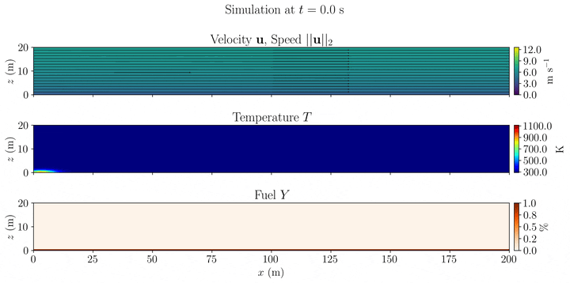
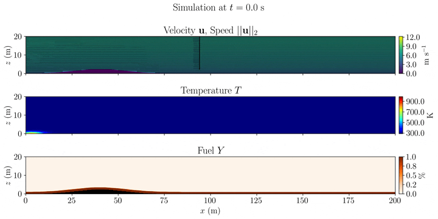

# Coupled Atmosphere-Wildfire Model
Numerical implementation of a simplified coupled atmosphere-fire mathematical model.

## Mathematical model
This code solves the following system of PDEs to simulate the spread of wildfires:

$$
\begin{split}
    \rho\left(\frac{\partial \mathbf{u}}{\partial t} + \left(\mathbf{u}\cdot\nabla\right)\mathbf{u}\right)
        & = -\nabla p  + \mu\left(\nabla^2\mathbf{u}+\dfrac13\nabla(\nabla\cdot\mathbf{u})\right)
        + \mathbf{f}, \\
    \rho c_p\left(\frac{\partial T}{\partial t} + \mathbf{u}\cdot\nabla T \right)
        &=\nabla\cdot(k\nabla T) + q,\\ 
    \frac{\partial Y}{\partial t} &= -Y_{\text{f}}\,Y\,K, \\ 
    %
    \nabla\cdot\mathbf{u} & = \dfrac{1}{\rho c_p T}\left(\nabla\cdot(k\nabla T) + q\right),  \\
    \rho (T)&=\dfrac{\rho_\infty T_{\infty}}{T},
    \\
    & + \text{Initial and boundary conditions}.
\end{split}
$$

More details in:
* San Martin, D., & Torres, C. E. (2025). **Simplified coupled atmosphere‑fire model for simulation of 2D wildland fires**. Computer Physics Communications. Available at: https://doi.org/10.1016/j.cpc.2025.109746

## Examples

### Flat terrain

### Simple hill

### More
See more **[here](./examples/README.md)**

