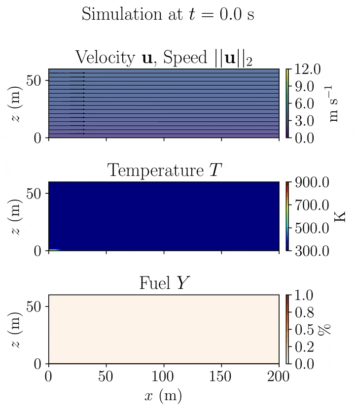
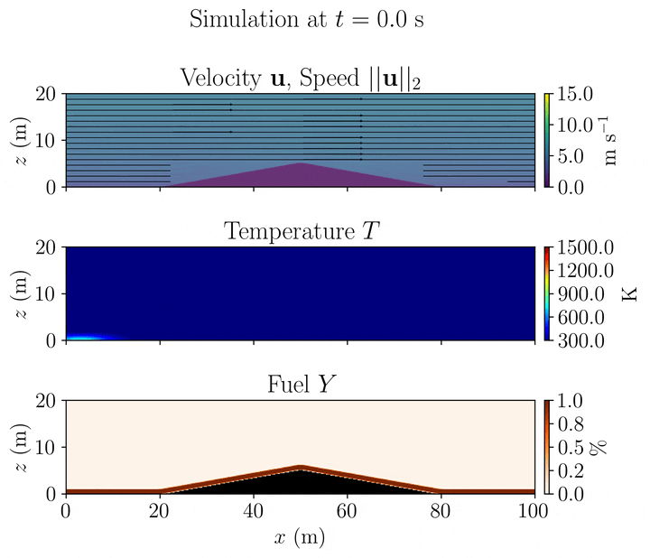
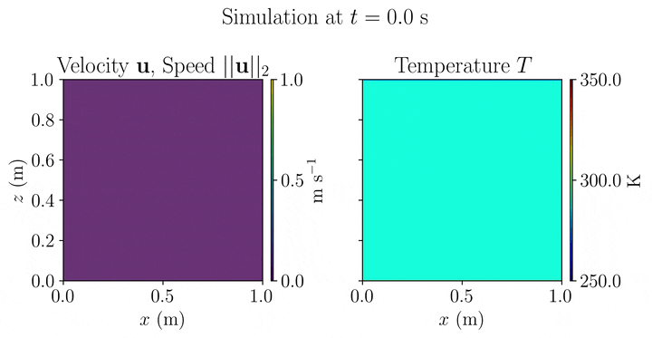

# Numerical simulations

A few experiments.

## Flat terrain

### Wind-driven 

### Plume-dominated

## Topography

### Triangular hill

### Gaussian hill

## Validation

### Rayleigh–Bénard convection

