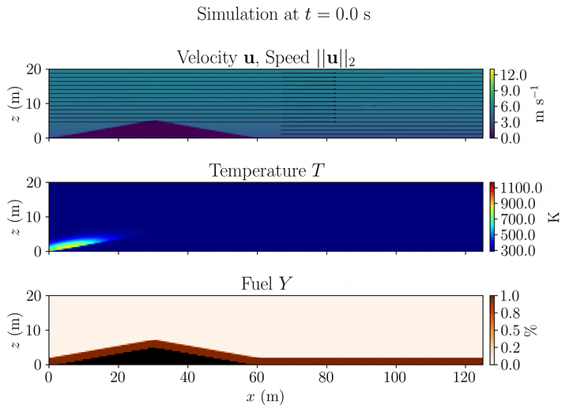
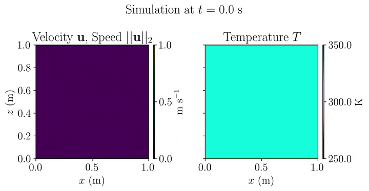
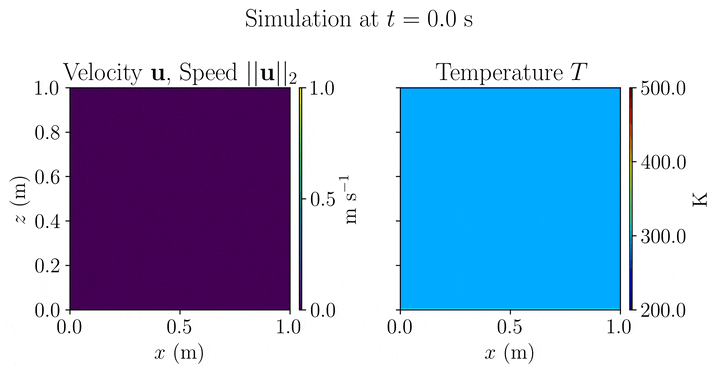

# Numerical simulations

A few experiments.

## Flat terrain

### Case F19

## Topography

### Triangular hill

### Gaussian hill

## Validation

### Rayleigh–Bénard convection

#### Temperature difference $30$ K

#### Temperature difference $100$ K
